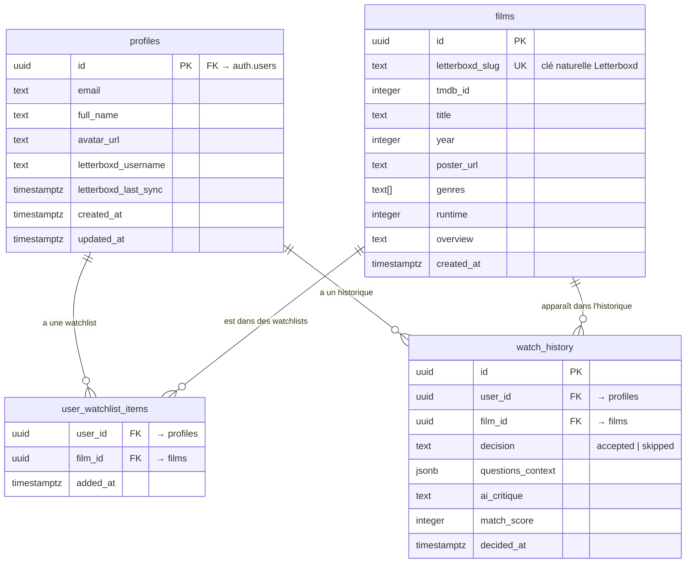
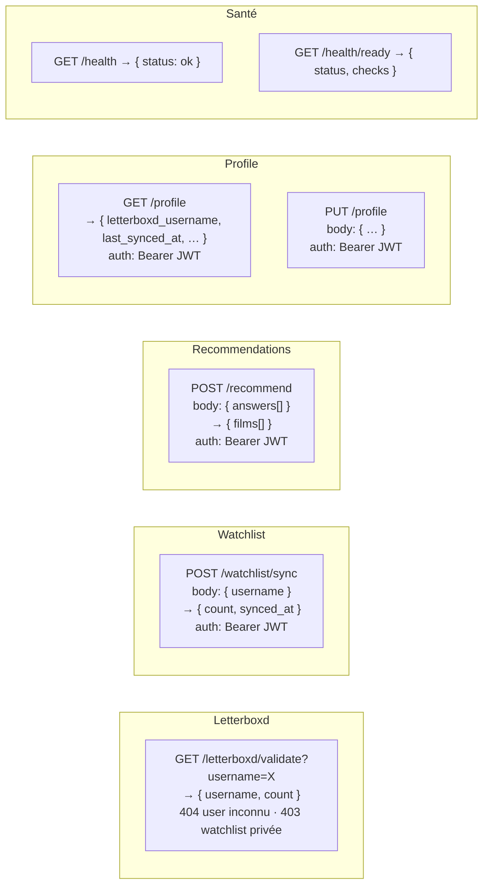
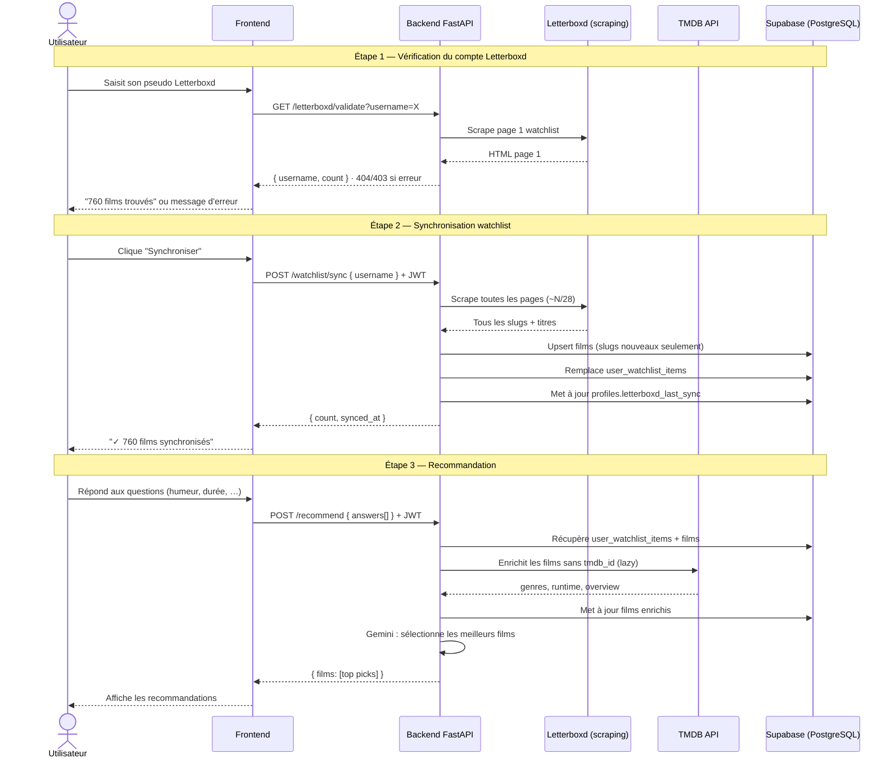

# CinePick — Architecture

## Schéma de base de données

> **Note :** Ce schéma remplace `watchlist_films` (dénormalisé, une ligne par user × film)
> par `films` (catalogue global) + `user_watchlist_items` (table de jonction).
> Les données TMDB (`genres`, `runtime`, `overview`) sont stockées une seule fois par film,
> quel que soit le nombre d'utilisateurs qui l'ont dans leur watchlist.
> L'enrichissement TMDB est **lazy** : déclenché à la première recommandation du film, pas à la sync.

---

## Routes API

### Flux utilisateur complet

---

## Ordre d'implémentation recommandé

| Ticket | Dépendances | Description |
|--------|-------------|-------------|
| **CIN-47** (révisé) | — | Créer `films` + `user_watchlist_items` (schéma normalisé) |
| **CIN-46** | CIN-47 | Implémenter POST /watchlist/sync réel (scraping toutes pages + DB) |
| **CIN-71** | CIN-46 | Topbar indicator (date dernière sync) |
| **CIN-72** | CIN-46 | Suppression cascade watchlist |
| Flow /recommend | CIN-46 | Questions → Gemini → résultats |
