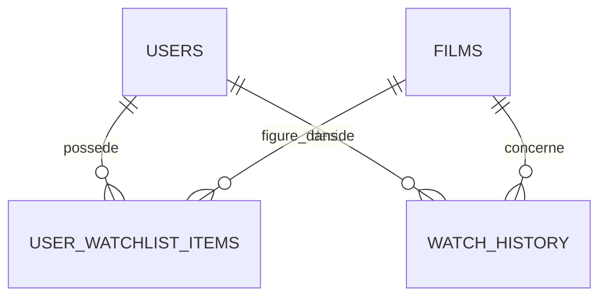

# Schéma DB — CinePick

> Rendu automatiquement par GitHub dans les blocs `mermaid`. Les commentaires entre guillemets sur
> chaque colonne expliquent le "pourquoi", pas juste le "quoi" — pensés pour qu'un outil ou une
> personne qui découvre le schéma comprenne les contraintes sans redécouvrir chaque décision.
> Détails complets et raisonnement long-form :
> [Specs DB (Linear)](https://linear.app/maximdubreil/document/specs-db-09a3daa57241).

## Relations (vue simplifiée)

Deux tables cœur (`users`, `films`, sources de vérité), reliées chacune aux deux tables de liaison
(`many-to-many`, relation où une ligne d'un côté peut correspondre à plusieurs lignes de l'autre et
inversement).

`user_watchlist_items` = "quels films sont dans la watchlist de quel utilisateur, en ce moment".
`watch_history` = "quelle décision un utilisateur a prise sur un film qui lui a été proposé". Un
film peut être dans l'un sans l'autre — c'est pour ça qu'il faut deux tables plutôt qu'un simple
statut sur une seule.

## Schéma complet annoté

```mermaid
erDiagram
    USERS ||--o{ USER_WATCHLIST_ITEMS : possede
    USERS ||--o{ WATCH_HISTORY : decide
    FILMS ||--o{ USER_WATCHLIST_ITEMS : figure_dans
    FILMS ||--o{ WATCH_HISTORY : concerne

    USERS {
        uuid id PK
        text email
        text full_name
        text avatar_url
        text letterboxd_username "pseudo Letterboxd connecte, source du scraping"
        timestamptz letterboxd_last_sync
        int4 letterboxd_film_count
        timestamptz created_at
        timestamptz updated_at
    }
    FILMS {
        uuid id PK
        text letterboxd_slug UK "cle de dedup : un film = une ligne partagee entre tous les users, jamais duplique"
        int4 tmdb_id "nullable, lien vers TMDB pour l'enrichissement"
        text title
        int4 year
        text poster_url "cache permanent, jamais supprime meme si watch_history l'est (cout de stockage quasi nul, evite un refetch TMDB)"
        array genres "DOIT contenir les genre_id TMDB (entiers), jamais les noms localises - non garanti par le type Postgres, a valider cote code de sync (POST /sync)"
        int4 runtime "peut etre 0 ou null sur TMDB : traiter comme non-filtrable plutot qu'exclu du filtre duree"
        text overview
        text_array origin_country "pays de production, PAS la langue - piege : un film UK a origin_country=GB mais original_language=en, filtrer sur la langue confond UK et US. NULLABLE (obligatoire malgre le default '{}') : un sync qui melange films enrichis et non-enrichis dans le meme upsert PostgREST envoie une valeur explicite NULL pour les lignes qui omettent la colonne des qu'une autre ligne du meme batch la fournit - une contrainte NOT NULL fait planter tout le sync (voir migration films_origin_country_nullable, backend/tests/test_watchlist_repository.py::test_upsert_films_mixed_batch_against_real_db)"
        text director "nom du realisateur, depuis TMDB credits.crew - nullable, meme regle d'ecriture best-effort que les autres colonnes d'enrichissement"
        array actors "jusqu'a 5 noms d'acteurs principaux, depuis TMDB credits.cast (ordre de billing) - nullable, meme regle d'ecriture best-effort et meme piege NULL-en-batch-mixte que genres/origin_country"
        text collection_name "nom de la saga/collection TMDB (belongs_to_collection.name), nullable si le film n'appartient a aucune"
        int2 collection_order "rang de ce film par date de sortie dans sa collection - PAS un ordre de visionnage canonique (ex: Evangelion Rebuild vs serie originale), nullable si pas de collection ou position introuvable cote TMDB"
        int2 collection_total "nombre de films dans la collection TMDB, a cote de collection_order"
        timestamptz created_at
    }
    USER_WATCHLIST_ITEMS {
        uuid user_id PK_FK
        uuid film_id PK_FK
        timestamptz added_at
        timestamptz removed_at "nullable = soft delete (garde la trace du retrait au lieu de supprimer la ligne au resync) - NULL signifie toujours actif dans la watchlist"
    }
    WATCH_HISTORY {
        uuid id PK
        uuid user_id FK
        uuid film_id FK
        uuid recommendation_session_id "genere par /recommend a chaque appel, pas nullable - relie une decision au bon lot de propositions (une meme session peut re-proposer un film revu apres 15min, /recommend/decision verifie session+film_id+'proposed' avant d'accepter la decision)"
        text decision "'proposed'/'accepted'/'skipped' (CHECK constraint) - jamais 'declined', valeur alignee sur le vocabulaire deja utilise dans l'UI (bouton Skip)"
        jsonb questions_context "snapshot des 9 reponses au moment de la decision - seule trace DB de la session, le reste (compteurs, conversation Gemini) reste volatile cote front"
        text ai_critique "vient de Gemini, NULL si court-circuit sans IA (sous-ensemble filtre <= 3 films, voir Specs AI)"
        int4 match_score "score de confiance donne par l'IA elle-meme (declaratif, pas calcule) - NULL si court-circuit sans IA"
        timestamptz decided_at
    }
```

## Ce qui n'est volontairement PAS dans ce schéma

Trois données existent dans le produit mais n'ont **aucune colonne** — décision volontaire, pas un
oubli :

| Donnée                        | Où elle apparaît                                                                       | Pourquoi pas de colonne                                                                                                |
| ----------------------------- | -------------------------------------------------------------------------------------- | ---------------------------------------------------------------------------------------------------------------------- |
| `providers` (dispo streaming) | Résultat, détail Historique                                                            | Refetch TMDB à chaque affichage — donnée trop volatile pour qu'un cache serve à quelque chose                          |
| `trailer_url`                 | Résultat (prévu, pas encore implémenté)                                                | Même traitement que `providers`, jamais lu depuis une colonne                                                          |
| Note TMDB (`vote_average`)    | Résultat, détail Historique ([CIN-104](https://linear.app/maximdubreil/issue/CIN-104)) | Même traitement que `providers` : une note change trop souvent pour être persistée durablement, toujours en fetch live |

**Règle générale à appliquer avant d'ajouter une colonne** : une donnée ne mérite une colonne que si
elle est lue quelque part sans repasser par un appel API externe. Si la réponse est "on la refetch
de toute façon à chaque fois qu'on l'affiche", pas de colonne.

## Ce qui n'existe pas non plus : table de session

Le "run" Questions → Résultat (réponses aux 8 questions, numéro de tentative `/recommend`) vit
entièrement en state front (React), jamais en DB. Seule la décision finale (accept/skip) survit,
dans `watch_history`. Détail complet du raisonnement :
[Specs DB (Linear)](https://linear.app/maximdubreil/document/specs-db-09a3daa57241#gestion-de-session--aucune-table-db-état-front-éphémère).

## Pour Claude Code — checklist de cohérence

Si tu modifies ce schéma ou le code qui l'utilise, vérifie que :

1. Tout insert dans `films.genres` écrit des `genre_id` TMDB (entiers), jamais des noms de genre
2. Tout insert dans `films.origin_country` utilise `origin_country`/`production_countries` de TMDB,
   jamais `original_language`
3. Aucun code ne réintroduit une colonne pour `providers`, `trailer_url` ou la note TMDB — ces trois
   données doivent rester en fetch live
4. `watch_history.decision` n'accepte que `'proposed'`/`'accepted'`/`'skipped'` (contrainte `CHECK`
   existante) — pas `'declined'` ni d'autre variante. `/recommend` insère les lignes en `'proposed'`
   ; `/recommend/decision` les fait passer à `'accepted'`/`'skipped'`, ce qui vérifie que le film a
   réellement été proposé avant d'accepter une décision dessus
5. Aucune table de session n'est ajoutée pour stocker l'état du flow Questions → Résultat — ça doit
   rester du state front
6. La table `watch_history` a désormais une policy RLS `UPDATE` (en plus d'insert/select),
   nécessaire pour que `/recommend/decision` puisse faire transitionner une ligne `'proposed'`
7. `films.tmdb_id`, `genres`, `runtime`, `origin_country`, `director`, `actors` restent tous
   NULLABLE — ne jamais remettre de contrainte `NOT NULL` dessus (voir le commentaire sur
   `origin_country` ci-dessus pour le pourquoi)
8. `repositories/watchlist.py::upsert_films` (`_ENRICHMENT_FIELDS`) n'écrit ces colonnes que si le
   film a été enrichi (`tmdb_id is not None`) — un échec d'enrichissement TMDB ne doit jamais
   écraser une valeur déjà connue dans ce cache partagé entre tous les users
